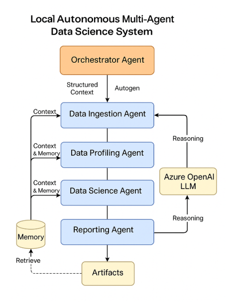

---

# 🔧 AutoDS Implementation Plan (Final – Local + Autogen + ChromaDB)

> **Last Updated**: December 1, 2025  
> **Status**: Phase 0-2 Complete, Phase 3 In Progress

---

## 🔹 Phase 0 – Setup & Orchestrator Skeleton ✅ COMPLETE

1. ✅ Create project structure:
   * `autods/`, `autods_cli.py`, `config.py`, `agents/`, `memory/`, `vectorstore/`
   
2. ✅ Setup config handling:
   * `.env` containing **only Azure OpenAI keys**, dataset paths, and metadata config
   * Pydantic-based configuration in `autods/config.py`
   
3. ✅ Implement a minimal **Orchestrator Agent**:
   * Accepts `dataset_id` and `goal` (e.g., "eda_report")
   * Sequences: `run_ingestion()` → `run_eda()` → `run_reporting()`
   * Logs execution with timing
   
4. ✅ Add Azure OpenAI client wrapper (no other Azure services)
   * Base agent with `call_llm()` method
   
5. ✅ Validate CLI execution:
   * `python autods_cli.py run --dataset demo_sales --goal eda_report`

---

## 🔹 Phase 1 – Data Ingestion Agent (Local & URL Support) ✅ COMPLETE

1. ✅ Define `datasets.yaml`:
   * Example: `demo_sales: local:./data/demo_sales.csv`
   * Also: `titanic: https://raw.githubusercontent.com/.../titanic.csv`
   
2. ✅ Implement **Dataset Registry** (`autods/registry.py`)
   * Loads `datasets.yaml` with Pydantic models
   
3. ✅ Implement **Storage Client** (`autods/storage.py`):
   * If `local:` → read via pandas
   * If URL → download using `requests` then load
   * Supports: CSV, JSON, Parquet, Excel
   
4. ✅ Implement agent (`autods/agents/ingestion_agent.py`):
   * Returns `pandas DataFrame` + schema (`dtype`, missing %, total rows)
   
5. ✅ Orchestrator updated:
   * `run_ingestion()` passes DataFrame to EDA

---

## 🔹 Phase 2 – EDA Agent + Reporting (MVP Pipeline) ✅ COMPLETE

1. ✅ EDA Agent logic (`autods/agents/eda_agent.py`):
   * Compute summary stats, missingness, value counts
   * Detect basic anomalies (outliers via IQR)
   * Correlation analysis for numeric columns
   
2. ✅ Azure OpenAI integration:
   * Send summary (not entire dataset) to LLM
   * Generate concise EDA insights with recommendations
   
3. ✅ Reporting Agent v1 (`autods/agents/reporting_agent.py`):
   * Generate Markdown report with tables
   * Save locally in `reports/` with timestamp
   
4. ✅ Orchestrator flow (`autods/agents/orchestrator.py`):
   * `ingestion → eda → reporting`
   
5. ✅ CLI (`autods_cli.py`):
   * `autods run --dataset demo_sales --goal eda_report`
   
6. ✅ Tested with multiple datasets:
   * `demo_sales` (local CSV) - 7.6s execution
   * `titanic` (URL) - 8.47s execution

---

## 🔹 Phase 3 – Memory, Context, and Agent Integration (ChromaDB) ⏳ IN PROGRESS

1. ✅ Introduced **ChromaDB-based memory system** (`autods/memory.py`)
   * Persistent local memory: `./vectorstore/`
   * Store EDA summaries, warnings, insights
   
2. 🔄 Implement memory retrieval:
   * Query via context prompt before each agent call
   
3. 🔄 Inject memory context into Azure OpenAI prompts

4. ✅ No Azure ML storage, no cloud data access

5. 🔄 Enable context-aware analysis for future runs

---

## 🔹 Phase 4 – Data Cleaning & Feature Engineering Agents 🔜 PLANNED

1. Data Cleaning Agent:
   * Rule-based cleaning: null imputation, dropping non-useful columns
   * Use Azure OpenAI only to generate explanation narrative (not execution logic)
   
2. Orchestrator Option:
   * `--with-cleaning`
   
3. Feature Engineering Agent:
   * Deterministic transformations (scikit-learn, pandas)
   * Local only
   
4. Memory update:
   * Store cleaning strategy + feature engineering summary in ChromaDB

---

## 🔹 Phase 5 – Local Modeling, Evaluation & Rich Reporting 🔜 PLANNED

1. Model Training Agent:
   * Use scikit-learn models (RandomForest, LogisticRegression)
   * Split dataset locally and train
   
2. Hyperparameter Tuning:
   * Local only (GridSearchCV or Optuna)
   
3. Evaluation Agent:
   * Metrics (Accuracy, RMSE, AUC etc.)
   * Save charts locally
   
4. Explainability Agent:
   * Run SHAP/LIME locally
   * Use Azure OpenAI to convert insights into human-readable explanation
   
5. Reporting Agent v2:
   * Full Markdown or HTML including:
     * Dataset summary
     * EDA insights
     * Cleaning steps
     * Model performance
     * Explainability results

---

## 🔹 Phase 6 – Local Deployment, Monitoring & Knowledge Retrieval 🔜 PLANNED

1. **Deployment Agent (local-only)**:
   * Serve model via FastAPI or Flask
   * Optional: Dockerized local endpoint
   
2. **Monitoring Hooks**:
   * Log predictions locally
   * Track drift & model decay manually
   
3. **Memory & Knowledge Agent**:
   * Store historical performance
   * Enable question answering from stored knowledge using Azure OpenAI + ChromaDB
   
4. **Conversational interface integration (optional)**:
   * "What was the accuracy last time on demo_sales dataset?"
   * "Which feature contributed most to churn prediction?"

---

# ⚙ Final Architecture Flow

```
CLI → Orchestrator Agent (Autogen)
    │
    ├─> Data Ingestion → EDA → Reporting
    │       │             │
    │       ├─────────────┘
    │       └ Memory Update (ChromaDB)
    │
Optional:
    ├─> Cleaning → Feature Engineering → Modeling → Evaluation → Explainability → Final Report
    │                       │
    │                       └ Memory Update
    │
    └→ Local Deployment & Feedback → Memory Update
```

---

# 📍 Final Notes

* **Azure OpenAI is the only external dependency**
* **All execution local, using filesystem + ChromaDB**
* **Autogen handles agent collaboration**
* **Memory drives contextual reasoning**
* **No Azure ML, no storage accounts, no pipelines**

---


